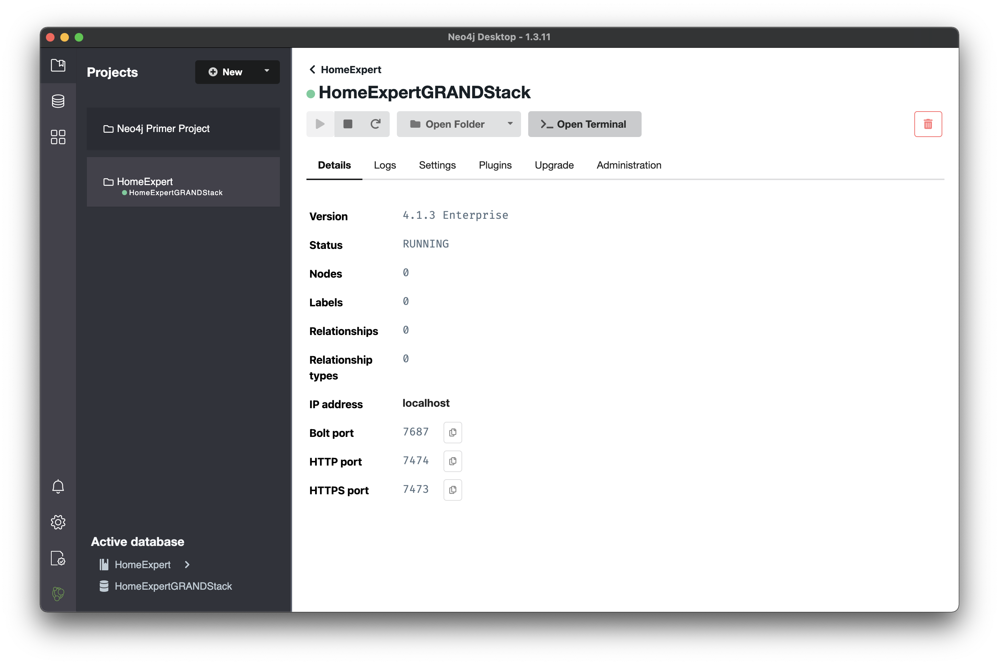

### Importing Geospatial data

Geospatial data downloaded from
http://ftp.geoinfo.msl.mt.gov/Data/Spatial/MSDI/Cadastral/Parcels/

Since downloaded data comes in form of `.shp` files, we need to somehow convert it to `.geojson` (why not just `.json` you might ask? explanation in further text).

#### Convert `.shp` files to `.geojson`

To do this we need to install [gdal](https://formulae.brew.sh/formula/gdal#default) CLI tool.
Once `gdal` is up and running, we need to use `ogr2ogr` script from its toolset like so:

```shell
ogr2ogr gallatin.geojson -f "GeoJSON" -lco id_field=PARCELID -t_srs "EPSG:4326" Gallatin_Parcels.shp
```

This will produce `gallatin.geojson` file.

### Importing `.geojson` to neo4j local DB

First we need to install neo4j [apoc](https://neo4j.com/developer/neo4j-apoc/) standard library. After installing apoc, we need to [configure it](https://neo4j.com/labs/apoc/4.1/config/#config-reference) to be able to do imports from file.

Neo4J allows us to launch terminal with all needed tools, so launch it and copy geojson to imports folder, take a look at screenshots below.





I chose to explicitly name all imported fields. It's important to know that neo4j has very limited field types (probably for performance reasons) so there are few rules to be followed here:

1. you can't nest objects into fields
2. you can have array as a field value, but It can't be nested

After carefully reading rules above, paste this cypher query to neo4j.

```cypher
call apoc.load.json("file:///gallatin.geojson") yield value
foreach (f in value.features |
    create (p:Property {
        propertyID: f.properties.PropertyID,
        countyName: f.properties.CountyName,
        countyAbbreviation: f.properties.CountyAbbr,
        taxYear: f.properties.TaxYear,
        assessment: f.properties.Assessment,
        township: f.properties.Township,
        range: f.properties.Range,
        section: f.properties.Section,
        legalDescription: f.properties.LegalDescr,
        subdivision: f.properties.Subdivisio,
        certificate: f.properties.Certificat,
        addressLine: f.properties.AddressLin,
        addressLine1: f.properties.AddressL_1,
        cityState: f.properties.CityStateZ,
        access: f.properties.PropAccess,
        levyDistrict: f.properties.LevyDistri,
        type: f.properties.PropType,
        continuous: f.properties.Continuous,
        buildingValue: f.properties.TotalBuild,
        landValue: f.properties.TotalLandV,
        totalValue: f.properties.TotalValue,
        farmsiteArea: f.properties.FarmsiteAc,
        forestArea: f.properties.ForestAcre,
        grazingArea: f.properties.GrazingAcr,
        wildHayArea: f.properties.WildHayAcr,
        irrigatedArea: f.properties.IrrigatedA,
        nonQualityArea: f.properties.NonQualAcr,
        totalArea: f.properties.TotalAcres,
        ownerName: f.properties.OwnerName,
        ownerAddress: f.properties.OwnerAddre,
        ownerAddressLine1: f.properties.OwnerAdd_1,
        ownerAddressLine2: f.properties.OwnerAdd_2,
        ownerCity: f.properties.OwnerCity,
        ownerState: f.properties.OwnerState,
        ownerZip: f.properties.OwnerZipCo,
        geometryType: f.geometry.type,
        geometryLength: f.properties.SHAPE_Leng,
        geometryArea: f.properties.SHAPE_Area
    })
)
```


You should have around **50k Property nodes** in DB now!!!

### Regenerating api `schema.graphql` and typings

Grandstack starter already has script for doing this and the only thing we have to do now is to point api to localDB in `./api/.env` like so:

```.env
# Use this file to set environment variables with credentials and configuration options
# This file is provided as an example and should be replaced with your own values
# You probably don't want to check this into version control!

NEO4J_URI=bolt://localhost:7687
NEO4J_USER=neo4j
NEO4J_PASSWORD=thalionQWER

# Uncomment this line to specify a specific Neo4j database (v4.x+ only)
#NEO4J_DATABASE=neo4j

GRAPHQL_SERVER_HOST=0.0.0.0
GRAPHQL_SERVER_PORT=4001
GRAPHQL_SERVER_PATH=/graphql
```

Make sure that api is running than from root folder run this command:

```shell
yarn inferSchema
```

This will generate new `schema.graphql` file to `./api/src/schema.graphql`.

To generate all other typings and react apollo hooks, again, make sure api is running and replace all previous `.graphql` with queries valid for new schema and finally from `./api` folder run this command:

```shell
npm run codegen
```

**Notice how half of codebase is autogenerated!**
